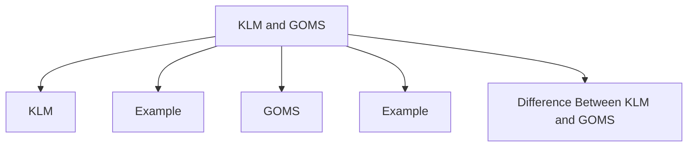

# KLM & GOMS



KLM and GOMS are analytical evaluation methods used to predict user performance without involving real users.

They are used to estimate how efficiently users can complete tasks and to compare different interface designs.



## KLM

KLM stands for **Keystroke-Level Model**.

It predicts how long a task will take by breaking the task into small actions and assigning time to each action.

KLM actions include:

| Symbol | Meaning |
|--------|---------|
| K | Key press |
| P | Pointing / mouse movement |
| H | Hand movement |
| M | Mental thinking |
| R | System response |

### KLM Formula

KLM estimates task time by summing operator times:

$$
T_{KLM} =
n_Kt_K + n_Pt_P + n_Ht_H + n_Mt_M + \sum R_i
$$

Where:

- \\(n_K\\), \\(n_P\\), \\(n_H\\), and \\(n_M\\) are counts of keystroke, pointing, hand movement, and mental operators
- \\(t_K\\), \\(t_P\\), \\(t_H\\), and \\(t_M\\) are standard or observed times for those operators
- \\(\sum R_i\\) is total system response time

For any operator sequence:

$$
T_{task} = \sum_{i=1}^{n} t_i
$$

## Example

Task: Search a video on YouTube.

```text
M → Think
P → Move mouse
K → Type
K → Press Enter
P → Click
```

KLM helps estimate the total time required to complete the task.

## GOMS

GOMS stands for **Goals, Operators, Methods, and Selection Rules**.

It models how users think and perform tasks.

| Component | Meaning | Example |
|----------|---------|---------|
| Goal | What the user wants to achieve | Send message |
| Operator | Basic action | Click, type, scroll |
| Method | Way to complete the task | Typing or voice message |
| Selection Rule | Rule for choosing a method | If driving, use voice |

### GOMS Formula

GOMS estimates method time from the operators required by a chosen method:

$$
T_{method} = \sum O_i
$$

If multiple methods are possible, selection rules choose one method:

$$
M^* = \underset{M_j \in M}{\operatorname{argmin}} T(M_j)
$$

In plain design terms: choose the method that fits the user's goal, context, and lowest expected cost.

## Example

Task: Send a message.

A user may complete this goal using different methods:

- Type the message
- Send a voice message

The selection rule determines which method is chosen.

Example:

```text
If the user is driving → use voice message
If the user is sitting freely → type message
```

## Difference Between KLM and GOMS

| Model | Focus | Use |
|------|------|-----|
| KLM | Task time | Measures efficiency |
| GOMS | User thinking and task structure | Explains how users perform tasks |
