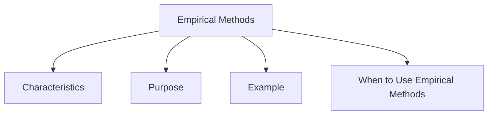

# Empirical Methods

Empirical Methods are evaluation methods that involve real users interacting with a system to collect evidence about usability and user experience (UX).

These methods focus on observing actual user behavior rather than predicting how users might behave. The data collected can be quantitative (measurable values) or qualitative (opinions, observations, and experiences).

Empirical methods are primarily used to validate design decisions and determine whether a system meets user needs in practice.

## Characteristics

- Involve real users or participants
- Measure actual system use
- Collect quantitative and qualitative data
- Evaluate usability and UX
- Help validate design assumptions
- Can be conducted in laboratories, remote settings, or real-world environments

## Purpose

Empirical methods help answer questions such as:

- Can users complete their tasks successfully?
- How long does a task take?
- What errors do users make?
- How satisfied are users with the system?
- How do users behave in real situations?

## Example

Suppose a new online shopping website is being developed.

Researchers ask users to:

- Search for a product
- Add it to the cart
- Complete checkout

During the evaluation they may measure:

- Task completion rate
- Time taken
- Number of errors
- User satisfaction

The collected results provide evidence about how well the design performs with real users.

## When to Use Empirical Methods

Empirical methods are most useful when:

- A prototype or system exists
- Designers need evidence from real users
- Usability and UX must be validated
- Design alternatives need comparison
- Feedback is required before or after deployment

Empirical evaluation provides direct evidence of how people actually use a system, making it one of the most important approaches for assessing usability and user experience.
