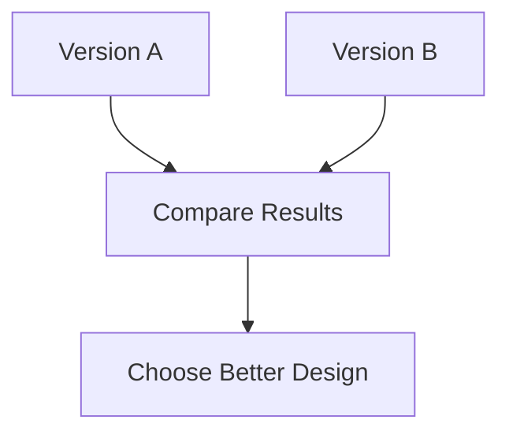

# A/B Testing

A/B Testing, also known as a Controlled Experiment, is an empirical evaluation method used to compare two versions of a design under controlled conditions.

Users are divided into groups, with each group interacting with a different version of the interface. The results are then compared to determine which design performs better.

The goal is to measure whether a design change produces a significant improvement in user behavior or performance.

## Example

Google tests:

- Version A → Blue button
- Version B → Green button

The click rate for each version is measured and compared.

## What Is Measured?

- Click rate
- Task success
- Conversion rate
- User performance metrics

## Where Applied

- Usability laboratories
- Live systems
- Websites and mobile applications

## When to Use

A/B testing is most useful when:

- Comparing design alternatives
- Measuring differences between designs
- Data-driven decisions are required

## Characteristics

- Real users
- Controlled comparison
- Quantitative data
- Measures actual user behavior

