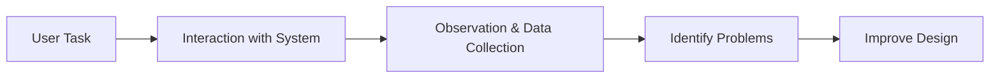

# Usability Testing

Usability Testing is an empirical evaluation method in which real users perform representative tasks while evaluators observe and measure their performance.

The goal is to determine whether users can effectively, efficiently, and satisfactorily use a system to achieve their objectives.

Unlike analytical methods, usability testing focuses on actual user behavior rather than predictions or expert opinions.

## Purpose

Usability testing helps answer questions such as:

- Can users complete the required tasks?
- How long do tasks take?
- What mistakes do users make?
- Where do users experience difficulties?
- Are users satisfied with the system?

## How It Works

A participant is given one or more realistic tasks to perform.

The evaluator observes the interaction and records usability metrics.

## Data Collected

### Quantitative Data

Measurable results such as:

- Task completion rate
- Time taken
- Number of errors
- Number of clicks
- Success rate

### Qualitative Data

Observational information such as:

- User comments
- Frustrations
- Confusion
- Satisfaction
- Suggestions

## Example

A participant is asked:

> "Search for a video on YouTube and play it."

The evaluator records:

- Time required to complete the task
- Whether the task was successful
- Errors made during the process
- User feedback after completion

## Where It Is Applied

Usability testing is commonly conducted in:

- Usability laboratories
- Research labs
- Remote testing environments
- Controlled testing sessions

These environments allow evaluators to observe users and collect accurate measurements.

## When to Use

Usability testing is most useful:

- During mid-stage development
- During late-stage development
- When a working prototype exists
- Before releasing a product
- When validating design improvements

## Advantages

- Direct observation of users
- Reveals real usability problems
- Provides quantitative and qualitative evidence
- Supports design improvement

## Limitations

- Requires participants
- Can be time-consuming
- May require specialized testing facilities
- Results can be affected by the testing environment

## Key Idea

Usability testing measures how well real users can perform real tasks using a system, making it one of the most widely used methods for evaluating usability.
