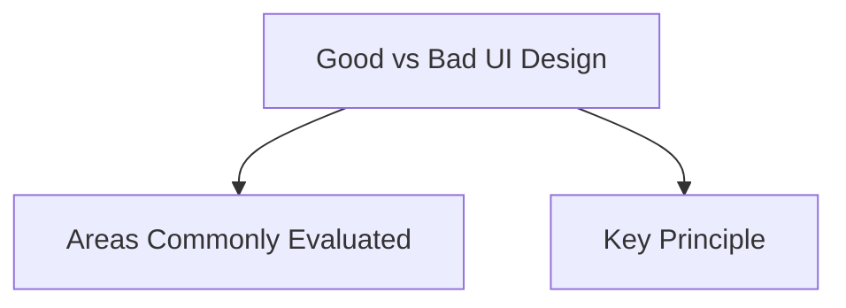

# Good vs Bad UI Design

Good and bad UI design examples help demonstrate why evaluation is important during the design process. By evaluating interfaces, designers can identify usability problems, reduce user frustration, and improve the overall user experience.

A good design follows users' expectations, provides clear feedback, reduces cognitive load, and supports efficient task completion. A bad design often creates confusion, increases errors, and makes tasks more difficult than necessary.

## Areas Commonly Evaluated

### Immediate Settings

Use toggle switches for settings that take effect immediately.

**Good Design**

- Toggle switch changes the setting instantly.
- Users understand that the action is applied immediately.

**Bad Design**

- Checkbox with a Save button for an immediate setting.
- Users may not know whether the change has already been applied.

### Grouped Selections

Use checkboxes when multiple options must be selected and confirmed together.

**Good Design**

- Select multiple options.
- Click Apply or Submit.

**Bad Design**

- Using toggles for grouped actions can create confusion about when changes take effect.

### User Input

Allow users to exceed character limits and provide clear feedback.

**Good Design**

- User can type or paste text.
- System explains that the limit has been exceeded.

**Bad Design**

- Input is blocked without explanation.

### Feedback

Provide feedback close to the action that caused it.

**Good Design**

- Inline feedback appears beside the relevant field or action.

**Bad Design**

- Temporary toast messages appear elsewhere and may be missed.

### Long Lists

Use searchable selection components for large datasets.

**Good Design**

- User types a few characters to find an item.

**Bad Design**

- User scrolls through hundreds of options in a dropdown.

### Modal Windows

Provide multiple ways to close dialogs.

**Good Design**

- Close button (X)
- Click outside
- Escape key

**Bad Design**

- Only one closing method available.

### Long Pages

Provide quick navigation aids.

**Good Design**

- Scroll-to-top button appears when needed.

**Bad Design**

- Users manually scroll through long pages.

### Long Operations

Keep users informed during processing.

**Good Design**

- Contextual loading messages
- Progressive status updates

**Bad Design**

- Generic spinner with no explanation

### Form Submission

Provide clear feedback when validation fails.

**Good Design**

- Submit button remains available.
- Errors are shown after submission.

**Bad Design**

- Disabled submit button with no explanation.

### Input Formatting

Format input automatically while users type.

**Examples**

- Phone numbers
- Credit card numbers
- Verification codes

### Loading States

Show the structure of incoming content.

**Good Design**

- Skeleton loading screens

**Bad Design**

- Generic spinner with no indication of what is loading.

## Key Principle

Good UI design reduces effort, provides clear feedback, and supports user goals. Bad UI design creates unnecessary friction, confusion, and uncertainty. Evaluation helps identify these issues before a product is released.
