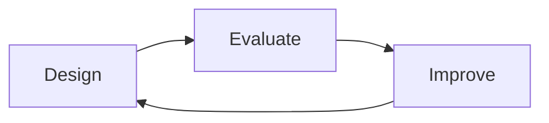
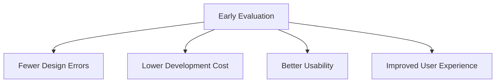

# Iterative Evaluation

Iterative Evaluation is the continuous process of designing, testing, improving, and retesting a system throughout development. Instead of waiting until the final product is complete, evaluation is performed repeatedly at different stages to identify problems early and refine the design.

The idea behind iterative evaluation is simple:

Each evaluation cycle provides feedback that is used to improve the design before moving forward.

## Why Iterative Evaluation is Important

Iterative evaluation helps:

- Detect usability problems early
- Reduce development costs
- Improve user satisfaction
- Validate design decisions
- Ensure requirements are being met

Problems found during early prototypes are usually inexpensive to fix, while problems discovered after deployment can require major redesign and redevelopment.

### Example

A food delivery app prototype is tested with users.

Evaluation reveals that users cannot easily find the checkout button.

The design team:

1. Modifies the interface
2. Tests the revised version
3. Collects new feedback
4. Makes further improvements if necessary

This cycle continues until the usability goals are achieved.

## Evaluation Throughout the Design Process

Evaluation should occur at every stage:

| Stage | Purpose of Evaluation |
|---------|----------------------|
| Conceptual Design | Check whether the idea solves the right problem |
| Early Prototypes | Identify major usability issues |
| Refined Prototypes | Improve interaction and navigation |
| Final Product | Verify usability and UX goals |
| Deployed Product | Gather feedback for future versions |

## What is Evaluated During Iteration?

Different artifacts can be evaluated as the design evolves:

- Conceptual models
- Sketches
- Wireframes
- Low-fidelity prototypes
- High-fidelity prototypes
- Complete systems
- Competing products

## Benefits of Early Evaluation

## Consequences of Evaluating Only at the End

If evaluation is postponed until development is complete:

- Problems are harder to fix
- Development costs increase
- Release schedules may be delayed
- User dissatisfaction becomes more likely

### Example

Changing a button position in a paper prototype may take a few minutes.

Changing the same feature after deployment may require:

- Interface redesign
- Code changes
- Additional testing
- Software updates

## Key Principle

Evaluation is not a separate activity performed after design is finished.

Design and evaluation work together continuously, with each evaluation cycle providing information that guides the next design improvement.
