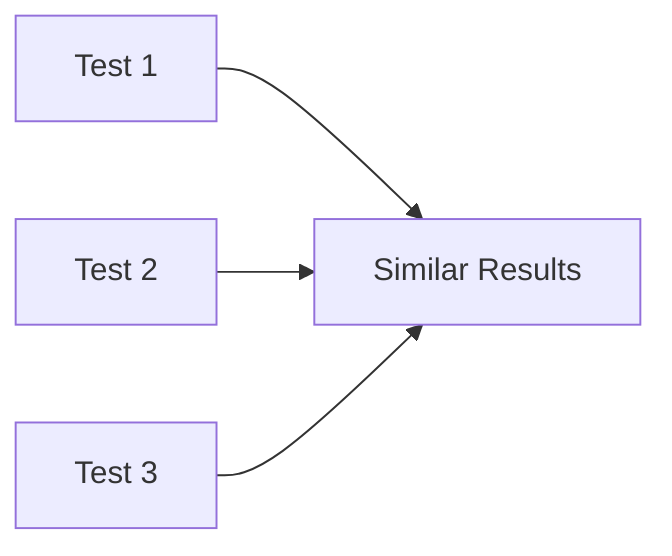
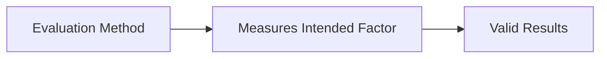
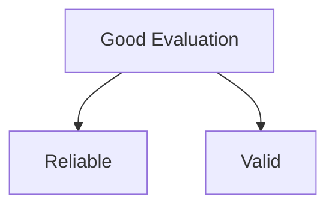

# Reliability & Validity

Reliability and Validity are important concepts used when interpreting evaluation results. They help determine whether the findings from an evaluation can be trusted and whether the evaluation measured what it was intended to measure.

## Reliability

Reliability refers to the consistency of an evaluation method.

A method is reliable if it produces the same or very similar results when repeated under the same conditions.

### Question

> Does the method produce the same results on separate occasions?

### Example

Suppose users perform the same task on the same system in multiple testing sessions.

If the completion times and results remain similar across sessions, the evaluation method is considered reliable.

## Validity

Validity refers to whether an evaluation measures what it is intended to measure.

A method may be reliable but still not be valid if it consistently measures the wrong thing.

### Question

> Does the method measure what it is intended to measure?

### Example

If the goal is to evaluate usability, but the evaluation mainly measures users' computer experience instead, the results may not be valid.

## Reliability vs Validity

| Reliability | Validity |
|------------|----------|
| Consistency of results | Accuracy of measurement |
| Same results when repeated | Measures the intended concept |
| Focuses on repeatability | Focuses on correctness |

## Relationship

A good evaluation should be both:

- Reliable (consistent)
- Valid (accurate)

