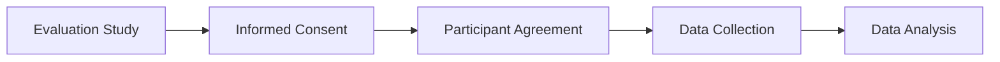

# User Consent & Ethics

Evaluation involving users must be conducted ethically and with respect for participants' rights.

Before participating, individuals should be informed about the purpose of the evaluation, what they will be asked to do, and how their data will be collected, stored, and used.

## Informed Consent

Participants must receive sufficient information before taking part in an evaluation and voluntarily agree to participate.

An informed consent form typically explains:

- Why the evaluation is being conducted
- What tasks participants will perform
- How data will be collected
- How data will be stored and used
- Participants' rights during the study

The consent form acts as an agreement between the participant and the researchers.

## Participants' Rights

Participants have the right to:

- Know the purpose of the evaluation
- Understand what is expected of them
- Be informed about data collection and storage
- Participate voluntarily

## Ethical Approval

The evaluation process is often reviewed and approved by a higher authority before the study begins.

This review may include:

- Evaluation procedures
- Consent forms
- Data collection methods
- Data analysis methods
- Data storage practices

## Importance

Ethical evaluation protects participants, ensures transparency, and helps maintain trust between researchers and users.
