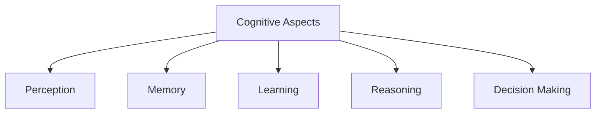

# Cognitive Aspects

Cognitive aspects refer to the mental processes involved when people interact with technology. These processes include thinking, perceiving, remembering, learning, reasoning, and making decisions.

Understanding cognition is important in Human-Computer Interaction (HCI) because it helps designers create systems that match human capabilities and limitations. By considering how users process information, designers can develop interfaces that are easier to learn, understand, and use.

Studying cognitive aspects also helps explain why users make mistakes, how they solve problems, and how interactive systems can better support human activities. Cognitive theories and frameworks provide guidance for designing effective, efficient, and user-friendly interfaces.
