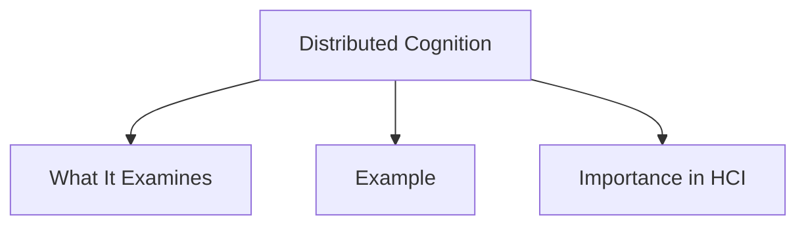

# Distributed Cognition

Distributed Cognition is concerned with understanding cognitive processes across individuals, artifacts, and both internal and external representations.

Rather than viewing thinking as something that occurs entirely within a person's mind, distributed cognition considers how information is shared, transformed, and communicated through people, tools, and environments.

Information moves through different forms of representation, such as:

- Computers
- Displays
- Documents
- Written notes
- Human memory

## What It Examines

Distributed cognition focuses on:

- How problem solving is distributed among people.
- The role of verbal and non-verbal communication.
- The rules and procedures used to coordinate activities.
- How communication changes as collaboration progresses.
- How knowledge is shared and accessed.

## Example

Air Traffic Control (ATC) is a distributed cognitive system.

Controllers, pilots, radar displays, procedures, and communication systems work together to manage aircraft safely. Information is continuously exchanged and transformed between people and technological systems rather than being held by a single individual.

## Importance in HCI

Distributed cognition helps designers understand how people interact with technology and each other while performing collaborative tasks.

It highlights the importance of communication, coordination, shared knowledge, and external representations in complex systems.
