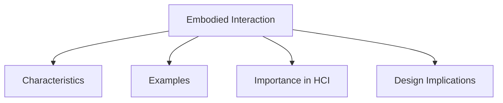

# Embodied Interaction

Embodied Interaction refers to the practical engagement of people with their social and physical environment. It focuses on how meaning is created through interaction with objects, technologies, and the world around us.

The concept emphasizes that human thinking is influenced by bodily actions and experiences. How people move, manipulate objects, and interact with their surroundings affects how they perceive, understand, and think about the world.

Embodied interaction suggests that cognition is not limited to the mind alone but is closely connected to physical activity and environmental interaction.

## Characteristics

- Involves interaction with physical and social environments.
- Creates meaning through action and experience.
- Connects perception, movement, and cognition.
- Supports both concrete and abstract understanding.

## Examples

- Using touch gestures on a smartphone.
- Manipulating objects in a virtual reality environment.
- Learning through physical interaction with educational tools.
- Using motion-based gaming systems.

## Importance in HCI

Embodied interaction provides new perspectives on how people use technology and can inspire better interaction design principles.

It highlights the idea that people often think through their actions and experiences rather than through mental processes alone.

## Design Implications

Understanding embodied interaction can help designers create systems that:

- Support natural physical interaction.
- Take advantage of human movement and perception.
- Provide more engaging user experiences.
- Better align with how people interact with the real world.
