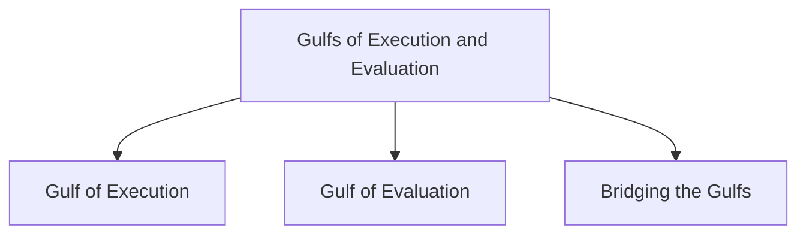

# Gulfs of Execution and Evaluation

The Gulfs of Execution and Evaluation describe the gaps that exist between users and an interactive system. They help explain the effort required for users to perform tasks and understand system responses.

## Gulf of Execution

The Gulf of Execution is the gap between what a user wants to do and the actions that the system allows them to perform.

It represents the distance from the user to the physical system.

A large gulf of execution makes it difficult for users to determine what action to take next.

### Example

A user wants to print a document but cannot easily find the print option in the interface.

## Gulf of Evaluation

The Gulf of Evaluation is the gap between the system's state and the user's ability to understand what the system has done.

It represents the distance from the physical system back to the user.

A large gulf of evaluation makes it difficult for users to interpret feedback and determine whether their goal has been achieved.

### Example

A user clicks a button but receives no visible feedback, making it unclear whether the action was successful.

## Bridging the Gulfs

Reducing both gulfs decreases the cognitive effort required to perform tasks.

Bridging the gulfs helps designers determine:

- Whether the interface makes it obvious what to do next.
- Whether users can easily understand system feedback.
- Whether the interface increases or decreases cognitive load.

Interfaces with small gulfs are generally easier to learn and use.
