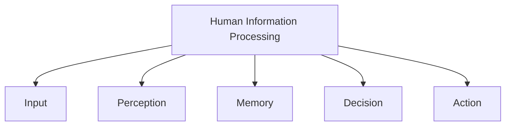

# Human Information Processing

Human Information Processing describes how people receive, store, process, and use information while interacting with their environment and technology. It is often compared to an information-processing system where information enters through the senses, is processed by the brain, stored in memory, and used to perform tasks.

In HCI, understanding how humans process information helps designers create interfaces that align with human cognitive abilities and limitations.

The process begins with information input through the senses such as vision, hearing, touch, and movement. This information is then interpreted and processed, stored in memory when needed, and later retrieved to support reasoning, problem solving, and decision making.

Human information processing is also influenced by emotions and individual differences. Factors such as stress, fatigue, age, experience, and physical abilities can affect how effectively users interact with a system.

## Example

When using a navigation app:

1. The user sees directions on the screen (visual input).
2. The information is interpreted and understood.
3. The next instruction is temporarily stored in memory.
4. The user decides which action to take.
5. The user performs the action, such as turning left or right.

This entire sequence demonstrates how information is received, processed, stored, and acted upon during interaction with a computer system.
