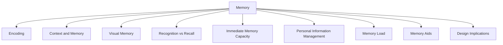

# Memory

Memory involves recalling knowledge and information that allows people to act appropriately. Examples include recognizing a person's face, remembering a name, or recalling how to perform a task.

Memory works through two main processes:

- Encoding information.
- Retrieving information.

People do not remember everything they encounter. Information is filtered and processed based on what receives attention.

## Encoding

Encoding is the first stage of memory.

It determines:

- Which information is attended to.
- How information is interpreted.

The more attention given to information, and the more it is processed through thinking, discussion, comparison, and reflection, the more likely it is to be remembered.

### Example

When studying HCI, discussing concepts, completing exercises, and writing notes leads to better memory than simply reading a textbook or watching a lecture.

## Context and Memory

The context in which information is learned affects how easily it can later be recalled.

Sometimes information is difficult to recognize when encountered in a different context from where it was originally learned.

### Example

You may not immediately recognize a neighbor when seeing them on a train because you are used to seeing them only in your apartment building.

## Visual Memory

People are generally very good at remembering visual information.

They often remember:

- Colors
- Locations
- Shapes
- Visual cues

People usually find it harder to remember arbitrary information such as dates, birthdays, and phone numbers.

### Example

Most people can remember the cover of a recently read book more easily than the birthdays of their grandparents.

## Recognition vs Recall

### Recall

Recall requires information to be retrieved directly from memory without cues.

### Recognition

Recognition involves identifying information when it is presented.

Recognition is generally easier than recall.

### Example

Command-line interfaces require users to recall commands from memory.

Graphical interfaces provide menus and icons that users only need to recognize.

Web browsers also support recognition through tabs, bookmarks, and history lists.

## Immediate Memory Capacity

George Miller (1956) proposed that people can hold approximately:

7 ± 2 items

in immediate memory.

However, this does not mean interfaces should always contain only seven options.

People can visually scan menus, tabs, and lists without having to remember all items at once.

The appropriate number of options depends on the task and available screen space.

### Example

A website may successfully use more than seven menu items because users recognize options visually rather than recalling them from memory.

## Personal Information Management

People accumulate large amounts of digital information such as:

- Documents
- Images
- Emails
- Attachments
- Videos
- Music
- Bookmarks

One challenge is remembering where information was stored and what it was named.

Common storage strategies include:

- Folders
- Naming conventions
- Categories

Research found that people often prefer scanning folders rather than relying entirely on search.

Smart search systems can assist by suggesting files from partial names or keywords.

### Example

Apple Spotlight helps users find files even when only part of the filename is remembered.

## Memory Load

Many modern systems require users to remember multiple pieces of information.

Examples include:

- Passwords
- ZIP codes
- Security questions
- Memorable dates

This increases memory load.

Password managers help reduce this burden by requiring users to remember only a single master password.

Biometric systems may further reduce memory demands in the future.

### Example

Multifactor authentication may require users to remember several credentials before accessing an account.

## Memory Aids

Technology can be used to support memory.

Examples include:

- Calendars
- Reminders
- Notes
- Wearable memory aids

SenseCam is a wearable device that automatically captures photographs throughout the day and has been shown to improve memory, particularly for people with dementia.

## Design Implications

- Reduce cognitive load.
- Avoid long and complicated procedures.
- Design for recognition rather than recall.
- Provide multiple ways to label information.
- Support organization using folders, categories, colors, flags, and timestamps.
- Help users locate information easily when needed.
