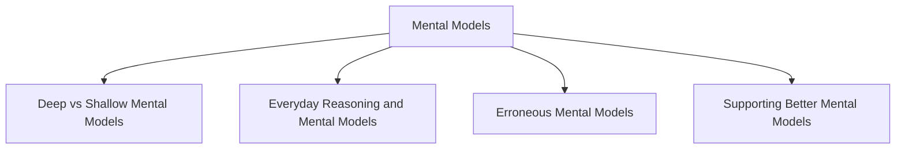

# Mental Models

Mental models are the understandings that users develop about how a system works through learning and experience. They help users predict system behavior, determine what actions to take next, and deal with unfamiliar situations.

Users rely on mental models to make inferences and decide how to interact with a system.

Craik (1943) described mental models as internal constructions of aspects of the external world that allow people to make predictions. Mental models involve both conscious and unconscious processes and often make use of imagery and analogies.

## Deep vs Shallow Mental Models

### Shallow Mental Model

Understanding how to use a system without understanding how it works internally.

#### Example

Knowing how to drive a car.

### Deep Mental Model

Understanding both how to use a system and how it works internally.

#### Example

Knowing how a car engine and transmission work.

## Everyday Reasoning and Mental Models

People often apply existing mental models to new situations.

Sometimes these models are correct, but they can also be inaccurate.

### Example: Thermostat

Many people believe that setting a thermostat to the highest temperature will heat a room faster.

This belief comes from a "more is more" mental model, similar to pressing a gas pedal harder to increase speed.

In reality, most thermostats work as on-off switches, so increasing the temperature setting does not make the room heat up faster.

### Example: Oven

Many people think setting an electric oven to a much higher temperature will make food cook faster.

Electric ovens operate similarly to thermostats, making this mental model incorrect.

## Erroneous Mental Models

Users frequently develop incomplete or incorrect understandings of how systems work.

These mental models are often based on:

- Inappropriate analogies
- Superstitions
- Incomplete knowledge

### Example

Pressing an elevator button multiple times because of the belief that it will arrive faster.

### Example

Pressing a pedestrian crossing button repeatedly to make the traffic lights change sooner.

## Supporting Better Mental Models

Interfaces should help users develop accurate understandings of how systems work.

This can be achieved through:

- Clear instructions
- Tutorials
- Context-sensitive guidance
- Help videos
- Chatbots
- Transparent interface design

Interfaces should also make available actions obvious through affordances.

### Examples of Affordances

- Swiping
- Clicking
- Selecting
- Dragging

When users form accurate mental models, they can predict system behavior more effectively and interact with the system with fewer errors.
