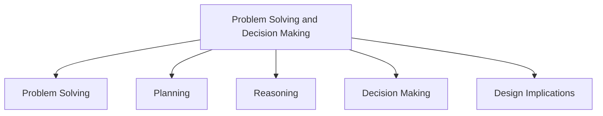

# Problem Solving and Decision Making

Problem solving, planning, reasoning, and decision making are cognitive processes that involve reflective thinking. They require people to think about what actions to take, what options are available, and what consequences may result from those actions.

These activities often involve conscious thought, discussions with others, or the use of external aids such as maps, books, notes, and diagrams. People may work through different scenarios, compare alternatives, and evaluate which option is most suitable.

## Problem Solving

Problem solving involves finding a solution to a task or situation.

### Example

Using a map to determine the best route to a destination.

## Planning

Planning involves organizing actions before carrying them out.

### Example

Creating a schedule for completing a project before beginning the work.

## Reasoning

Reasoning involves thinking logically about information and drawing conclusions.

### Example

Comparing different products before deciding which one to purchase.

## Decision Making

Decision making involves selecting one option from several alternatives.

People often evaluate advantages, disadvantages, and possible outcomes before making a choice.

### Example

Choosing between multiple universities based on cost, location, and academic programs.

## Design Implications

- Provide help and information that is easy to access.
- Support users in understanding how to perform tasks effectively.
- Use simple and memorable functions.
- Design interfaces that support rapid planning and decision making.
