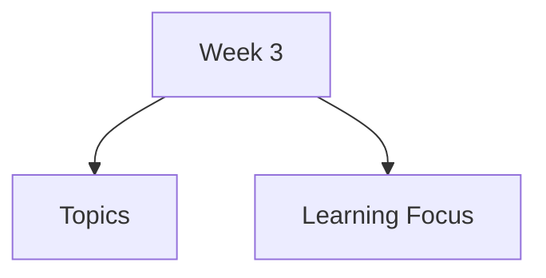

# Week 3

Week 3 introduces interaction models, ergonomic concerns, and common interaction styles. The focus is on how users move from goals to actions, how systems communicate results, and how interface styles shape the user's experience.

## Topics

- [Interaction Models](interaction-models/)
  - [Norman's Interaction Model](interaction-models/normans-interaction-model/)
  - [Abowd and Beale Framework](interaction-models/abowd-beale-framework/)
  - [Execution and Evaluation](interaction-models/execution-evaluation/)
  - [Gulfs of Execution and Evaluation](interaction-models/gulfs-execution-evaluation/)
- [Ergonomics](ergonomics/)
- [Interaction Styles](interaction-styles/)
  - [Command Line Interfaces](interaction-styles/command-line-interfaces/)
  - [Menus](interaction-styles/menus/)
  - [Natural Language Interfaces](interaction-styles/natural-language-interfaces/)
  - [Query Interfaces](interaction-styles/query-interfaces/)
  - [Form-Fill Interfaces](interaction-styles/form-fill-interfaces/)
  - [Spreadsheets](interaction-styles/spreadsheets/)
  - [WIMP Interfaces](interaction-styles/wimp-interfaces/)
    - [Windows, Icons, Menus, and Pointers](interaction-styles/wimp-interfaces/windows-icons-menus-pointers/)
    - [Dialog Boxes and Toolbars](interaction-styles/wimp-interfaces/dialog-boxes-toolbars/)
    - [WIMP Design Principles](interaction-styles/wimp-interfaces/wimp-design-principles/)

## Learning Focus

By the end of this week, you should be able to explain major interaction models, identify execution and evaluation problems, compare interaction styles, and describe the structure and design principles of WIMP interfaces.
