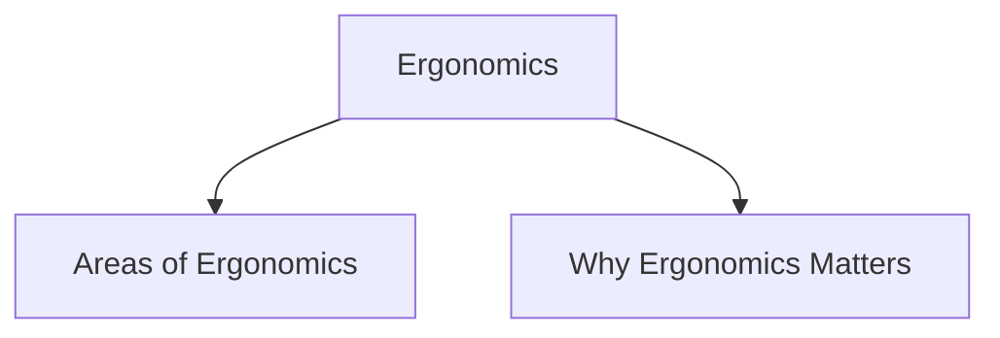

# Ergonomics

Ergonomics is the study of the physical characteristics of interaction between humans and computer systems.

It is also known as **Human Factors**. The goal of ergonomics is to design interfaces, devices, and environments that improve user performance, comfort, safety, and efficiency.

Ergonomics helps designers create systems that fit the capabilities and limitations of users rather than forcing users to adapt to the system.

## Areas of Ergonomics

### Arrangement of Controls and Displays

Controls and displays should be organized in a logical manner.

They may be grouped:

- According to function
- According to frequency of use
- In the order they are used

### Surrounding Environment

The physical environment affects interaction quality.

Examples include:

- Adjustable seating arrangements
- Workspace design suitable for different users
- Proper positioning of equipment

### Health Issues

Physical and environmental conditions can affect user performance and well-being.

Examples include:

- User posture and physical position
- Temperature and humidity
- Lighting conditions
- Noise levels

### Use of Colour

Colours can communicate information and improve usability.

Examples:

- Red for warnings or errors
- Green for successful operations or safe conditions

Designers must also consider users with colour-vision deficiencies.

## Why Ergonomics Matters

Poor ergonomics can lead to:

- Reduced efficiency
- Increased errors
- User discomfort
- Fatigue and health problems
- Frustrating user experiences

Good ergonomics improves usability by making interaction more comfortable, effective, and efficient.
