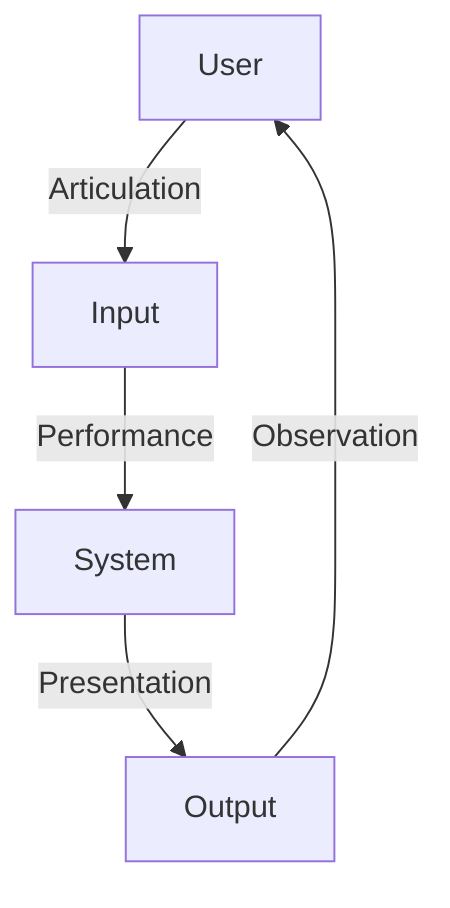

# Abowd and Beale Framework

The Abowd and Beale Framework is an extension of Norman's Interaction Model. While Norman's model focuses mainly on the user's perspective, Abowd and Beale explicitly include the system and the interface in the interaction process.

The framework describes interaction as a set of translations between four components:

- User
- Input
- System
- Output

## Interaction Cycle

The framework identifies four main steps in the interaction cycle:

1. The user formulates a goal and a task to achieve that goal.
2. The interface translates the user's input into a form the system can understand.
3. The system processes the input and changes its state.
4. The system presents the new state to the user through the interface.

## Translations in the Framework

The interaction process consists of four translations.

### Articulation

Translation of the user's task language into the interface's input language.

The user expresses what they want to do using the controls provided by the interface.

**Good Articulation**

A bank of switches is clearly labeled. The user can easily identify the switch that controls the lights at the far end of the room.

**Poor Articulation**

The switches are unlabeled. The user cannot determine which switch controls the desired lights.

**Articulation Error**

The user formulates or performs the wrong action.

Example:

A user selects text in Microsoft Word and accidentally presses the delete shortcut instead of the copy shortcut.

### Performance

Translation of the input language into the system's core language.

The system interprets the user's actions, executes them, and updates its internal state.

**Performance Error**

The system cannot understand the intended action or does not support it.

Example:

A television remote control does not provide a power-off button, forcing the user to turn off the television manually.

### Presentation

Translation of the system's core language into the output language presented through the interface.

The system communicates the results of its actions to the user.

**Good Presentation**

"Unable to install the application. Phone memory is full. Please free some space and try again."

**Poor Presentation**

"Unable to install the application."

The user receives insufficient information to understand the problem.

### Observation

Translation of the output language into the user's understanding.

The user interprets the information presented by the system.

**Observation Error**

The user misinterprets or ignores the feedback.

Example:

A dialog box offers **Save and Close** and **Close**. The user accidentally selects **Close** without noticing the save option.

## Example: Game Configuration

The framework can be used to identify interaction problems when configuring a game.

### Articulation Problem

The user is unsure which options must be selected to configure the game correctly.

### Performance Problem

The controller does not allow the user to select a required option.

### Presentation Problem

The display does not indicate that an option has been successfully selected.

### Observation Problem

The user misinterprets the information shown on the display.

Any one of these problems can cause interaction difficulties.

## Importance

The Abowd and Beale Framework provides a more complete description of interaction by considering the user, interface, and system together. It helps designers analyze where communication failures occur and improve the usability of interactive systems.
