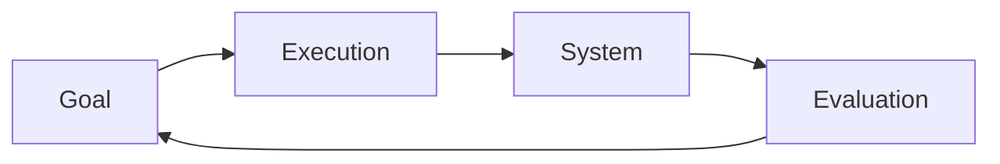

# Execution and Evaluation

In Norman’s Interaction Model, interaction is viewed as a continuous cycle between the user and the system. This cycle is divided into two major phases: Execution and Evaluation.

## Execution

Execution is the process through which the user translates a goal into actions that can be performed on the system.

It includes:

1. Establishing the goal
2. Forming the intention
3. Specifying the action
4. Executing the action

During execution, the user decides what they want to achieve, determines how to achieve it, and performs the required actions through the interface.

Example:

- Goal: Create an account
- Intention: Use an email address to sign up
- Specify action: Fill out the registration form
- Execute action: Enter information and click **Sign Up**

## Evaluation

Evaluation is the process through which the user examines and understands the system's response.

It includes:

1. Perceiving the system state
2. Interpreting the system state
3. Evaluating the system state

During evaluation, the user observes the feedback provided by the system, interprets its meaning, and determines whether the original goal has been achieved.

Example:

- Perceive: "Account created successfully" message appears
- Interpret: The account has been created but email verification is required
- Evaluate: The goal is achieved once email verification is completed

## Execution–Evaluation Loop

The interaction continues through this loop until the user's goal is successfully achieved.
