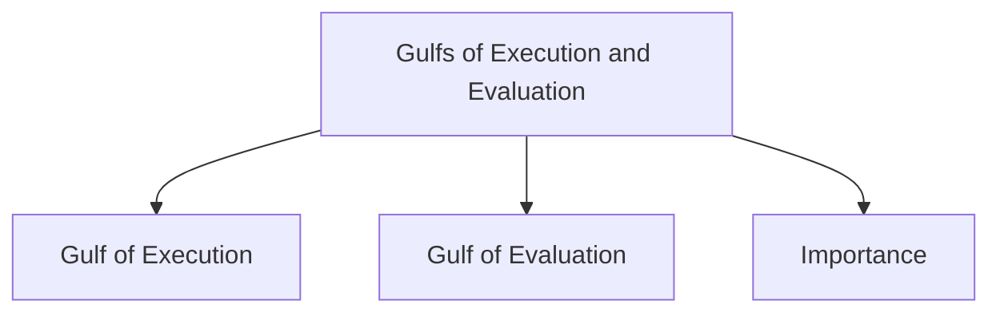

# Gulfs of Execution and Evaluation

The concepts of the Gulf of Execution and Gulf of Evaluation were introduced by Donald Norman to explain why some systems are harder to use than others.

A gulf represents a gap between the user and the system during interaction.

## Gulf of Execution

The Gulf of Execution is the difference between what a user wants to do and what the system allows the user to do.

It occurs when users cannot easily determine how to perform an action using the interface.

### Causes

- Unclear controls
- Confusing commands
- Poorly organized menus
- Missing functionality
- Complex interaction procedures

### Example

A user wants to print a document but cannot find the print option because it is hidden deep inside several menus.

In this case:

User's intended action ≠ Actions allowed or visible in the system

## Gulf of Evaluation

The Gulf of Evaluation is the difference between the user's expectation of the system state and the way the system presents that state.

It occurs when users cannot easily understand what happened after performing an action.

### Causes

- Poor feedback
- Ambiguous messages
- Hidden system status
- Unclear results of actions

### Example

A user clicks a button to save a file, but no confirmation message or visual indication is provided. The user is unsure whether the file was saved successfully.

In this case:

User's expectation of system state ≠ Actual presentation of system state

## Importance

Good interface design minimizes both gulfs.

- A small Gulf of Execution makes actions easy to discover and perform.
- A small Gulf of Evaluation makes system feedback easy to understand.

Reducing these gulfs improves usability, learnability, and overall user experience.
