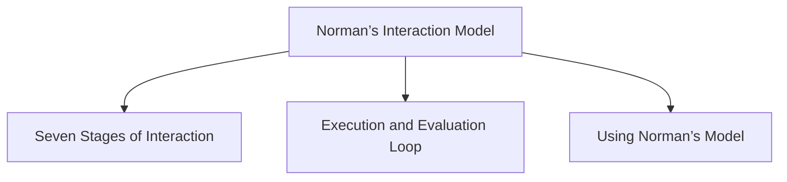

# Norman’s Interaction Model

Norman’s Interaction Model describes interaction as a cycle between the user and the system. It focuses on how users form goals, perform actions, and evaluate system responses while trying to accomplish a task.

The model is centered on the user's view of the interaction and consists of seven stages.

## Seven Stages of Interaction

### 1. Establishing the Goal

The user determines what they want to achieve.

Example:
"I want to create an account."

### 2. Forming the Intention

The user decides how the goal will be achieved.

Example:
"I will sign up using my email address."

### 3. Specifying the Action

The user plans the specific actions needed to perform the task.

Example:

- Click the **Sign Up** button
- Enter name, email, and password
- Submit the registration form

### 4. Executing the Action

The user performs the planned actions through the interface.

Example:

- Types the required information
- Clicks the **Sign Up** button

### 5. Perceiving the System State

The user observes the feedback provided by the system.

Example:

- "Account created successfully" message appears
- Email verification prompt is displayed

### 6. Interpreting the System State

The user understands the meaning of the feedback.

Example:

"My account has been created, but I must verify my email before using it."

### 7. Evaluating the System State

The user compares the result with the original goal.

Example:

"After verifying my email, I can log in. My goal has been achieved."

## Execution and Evaluation Loop

Norman's model can be divided into two parts:

### Execution

The user moves from goal to action.

- Establishing the goal
- Forming the intention
- Specifying the action
- Executing the action

### Evaluation

The user examines the system's response.

- Perceiving the system state
- Interpreting the system state
- Evaluating the system state

The interaction continues as a cycle until the user's goal is achieved.

## Using Norman’s Model

Norman's model helps explain why some systems are easier to use than others. It is commonly used to identify usability problems during interaction.

### Gulf of Execution

Occurs when the user's desired actions do not match the actions provided by the system.

User's intended action ≠ Actions allowed by the system

### Gulf of Evaluation

Occurs when the user cannot easily determine whether the system has responded correctly.

User's expectation of the system state ≠ Actual presentation of the system state

Large gulfs make systems more difficult to learn and use, while small gulfs make interaction easier and more intuitive.
