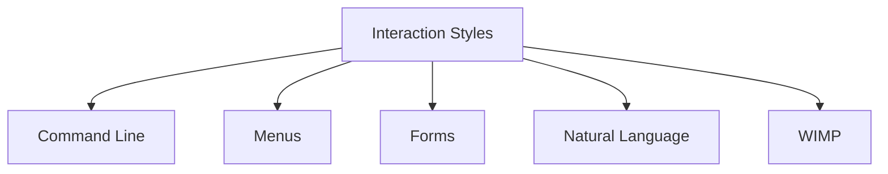

# Interaction Styles

Interaction styles are the different ways in which users communicate and interact with computer systems. They define the form of dialogue between the user and the system and determine how commands, information, and feedback are exchanged.

An interaction style influences how easy a system is to learn, how efficiently tasks can be performed, and the overall user experience. Different systems may use different interaction styles depending on their purpose, users, and tasks.

The choice of interaction style affects factors such as usability, learnability, flexibility, and user satisfaction. Each style provides a different approach to interaction and may be more suitable for certain users or application domains than others.

Interaction styles are an important part of interface design because they shape the nature of communication between users and computer systems.
