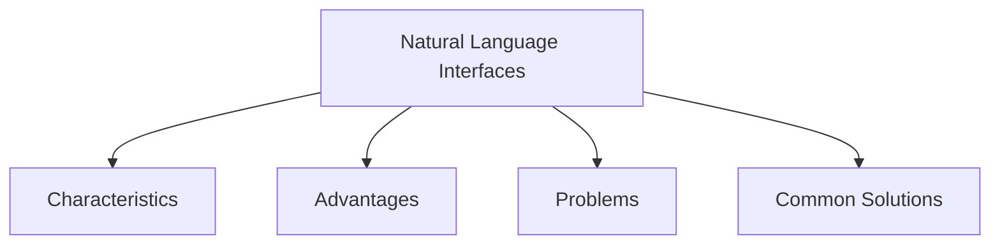

# Natural Language Interfaces

Natural Language Interfaces allow users to interact with computer systems using everyday human language, either through speech or typed text.

Because natural language is familiar to users, this interaction style can feel more natural and intuitive than learning commands or menu structures.

Natural Language Interfaces typically use:

- Speech recognition
- Typed natural language input

The system attempts to interpret the user's request and translate it into actions that can be performed.

## Characteristics

- Uses ordinary human language
- Supports spoken or typed interaction
- Designed to make communication with computers more natural
- Reduces the need to learn commands or specialized syntax

## Advantages

- Familiar to users
- Easy to understand
- Can provide a more natural interaction experience
- Reduces the need for training

## Problems

Natural language is difficult for computers to process because it can be:

- Vague
- Ambiguous
- Complex
- Dependent on context

As a result, Natural Language Interfaces are difficult to design and implement effectively.

## Common Solutions

To reduce ambiguity, systems often:

- Understand only a limited subset of the language
- Focus on important keywords
- Restrict the types of questions or commands that can be used

These approaches make interpretation more reliable while keeping interaction relatively natural.
