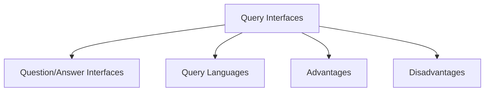

# Query Interfaces

Query Interfaces are interaction styles that allow users to obtain information by asking questions or submitting queries to a system.

They are commonly used in information retrieval systems and databases where users need to search for specific information.

There are two main forms of query interfaces:

- Question/Answer Interfaces
- Query Languages

## Question/Answer Interfaces

In a question/answer interface, the user is guided through the interaction by a series of questions.

The system asks questions and the user provides responses until the required information is obtained.

### Characteristics

- User is guided through the interaction
- Structured sequence of questions
- Limited flexibility
- Often used in information systems

### Advantages

- Easy for novice users
- Requires little technical knowledge
- Provides guided interaction

### Disadvantages

- Restricted functionality
- Limited flexibility for complex requests

## Query Languages

Query languages allow users to retrieve information by writing queries in a specialized language.

A common example is SQL (Structured Query Language), which is used to retrieve information from databases.

### Characteristics

- Direct access to database information
- Uses a formal query syntax
- Provides flexible information retrieval

### Requirements

Users must understand:

- Database structure
- Query language syntax

Because of these requirements, query languages generally require more expertise than question/answer interfaces.

## Advantages

- Powerful and flexible
- Can retrieve complex information
- Efficient for experienced users

## Disadvantages

- Requires technical knowledge
- Users must learn the query language
- More difficult for novice users
