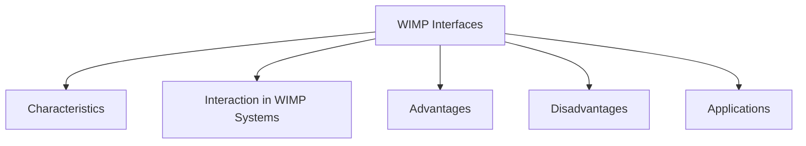

# WIMP Interfaces

WIMP stands for:

- Windows
- Icons
- Menus
- Pointers

It is the default interaction style used by most modern graphical user interfaces, particularly on desktop and personal computer systems.

WIMP interfaces allow users to interact with systems through graphical elements rather than typing commands. Users perform actions by selecting, moving, opening, closing, and manipulating objects displayed on the screen.

The WIMP style is based on direct manipulation, where users interact with visible objects and receive immediate feedback from the system.

## Characteristics

- Graphical rather than text-based interaction
- Uses visual objects and controls
- Supports pointing and selection
- Provides immediate feedback
- Reduces the need to memorize commands
- Allows multiple tasks and applications to be managed visually

## Interaction in WIMP Systems

Users typically interact by:

- Pointing at objects
- Selecting options
- Dragging and dropping items
- Opening and closing applications
- Choosing commands from menus
- Manipulating graphical elements directly

Various input devices can be used, including:

- Mouse
- Trackpad
- Trackball
- Joystick
- Cursor keys
- Keyboard shortcuts

## Advantages

- Easy to learn
- Supports recognition rather than recall
- Provides visual feedback
- Reduces typing requirements
- Suitable for a wide range of users
- Makes system functionality easier to discover

## Disadvantages

- Can consume significant screen space
- Complex interfaces may become cluttered
- Large numbers of graphical elements may confuse users
- May be less efficient than command-line interfaces for expert users

## Applications

WIMP interfaces are widely used in:

- Desktop operating systems
- Personal computer applications
- File management systems
- Office productivity software
- General-purpose graphical user interfaces

The WIMP paradigm became the dominant style of interaction because it provides an intuitive and visually oriented way for users to communicate with computer systems.
