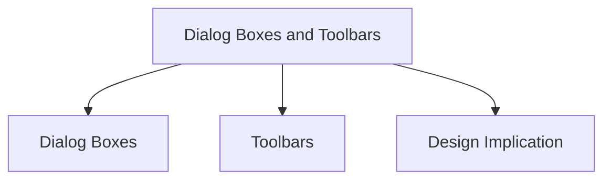

# Dialog Boxes and Toolbars

Dialog Boxes and Toolbars are important components of WIMP interfaces that provide users with access to information, commands, and functionality.

## Dialog Boxes

Dialog boxes are information windows that appear temporarily to inform users about important events or request information.

They are commonly used when the system needs user input or confirmation before continuing.

### Examples

- Confirming an action
- Displaying an error message
- Requesting information from the user
- Specifying a filename and location when saving a file

After the required action is completed, the dialog box usually disappears.

### Characteristics

- Secondary windows
- Support less common tasks
- Group related functionality together
- Used to execute commands or request information
- Can provide alerts and error messages

### Types of Dialog Boxes

#### Modal Dialog Boxes

Modal dialog boxes block interaction with the rest of the application until the dialog is closed.

Example:

A confirmation box asking whether a file should be deleted.

#### Modeless Dialog Boxes

Modeless dialog boxes do not block interaction.

Users can leave the dialog box open and continue working elsewhere in the application.

Example:

A formatting or preferences window that can remain open while editing a document.

### Expanding Dialog Boxes

Some dialog boxes can expand to reveal advanced options.

This allows novice users to see only essential controls while giving experienced users access to additional functionality.

## Toolbars

Toolbars are collections of icons or buttons that provide quick access to commonly used actions.

They are typically displayed as horizontal or vertical rows of controls.

### Characteristics

- Provide fast access to frequent operations
- Reduce the need to navigate menus
- Consist mainly of icons or buttons
- Often visually grouped by related functions

### Advantages

- Faster access to commands
- Improves efficiency for frequent tasks
- Reduces navigation through menu structures

### Customization

Many applications allow users to customize toolbars by:

- Choosing which toolbars are visible
- Adding or removing commands
- Rearranging toolbar contents

### Toolbar Buttons

Toolbar buttons often appear as icons that behave like buttons.

They are grouped together to provide quick access to related actions and functions.

## Design Implication

Dialogs should not interrupt unnecessarily, and toolbars should not become cluttered with rarely used commands.

## Related Notes

- [WIMP Interfaces](../)
- [WIMP Design Principles](../wimp-design-principles/)
- [Error Prevention and Recovery](../../../../week-11/usability-principles/error-prevention-recovery/)
