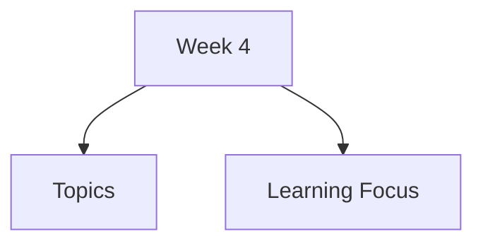

# Week 4

Week 4 covers the interaction design process: how designers understand problems, involve users, generate alternatives, evaluate designs, and connect HCI work with practical development workflows.

## Topics

- [Interaction Design Process](interaction-design-process/)
  - [Problem Space](interaction-design-process/problem-space/)
  - [User Involvement](interaction-design-process/user-involvement/)
  - [User-Centered Design](interaction-design-process/user-centered-design/)
  - [Interaction Design Activities](interaction-design-process/interaction-design-activities/)
  - [Lifecycle Models](interaction-design-process/lifecycle-models/)
- [Users and Stakeholders](users-and-stakeholders/)
- [User Needs](user-needs/)
- [Alternative Designs](alternative-designs/)
- [Design Evaluation](design-evaluation/)
- [Agile Integration](agile-integration/)

## Learning Focus

By the end of this week, you should be able to describe the main activities in interaction design, explain why users and stakeholders matter, define user needs, compare alternatives, and evaluate designs throughout development.
