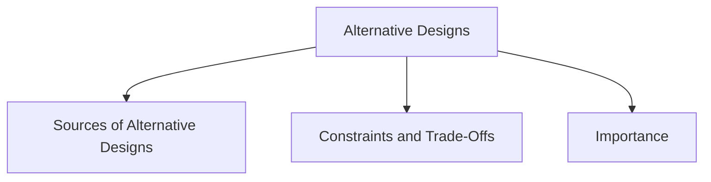

# Alternative Designs

Generating alternative designs is a key activity in interaction design. Instead of accepting the first solution that works, designers explore different possibilities to identify better designs.

Humans naturally tend to stick with familiar solutions. Considering alternatives helps reveal designs that may better satisfy user needs and project goals.

## Sources of Alternative Designs

### Flair and Creativity

Alternative designs can emerge through creativity, research, and synthesis of ideas.

### Cross-Fertilization of Ideas

New ideas can be generated by combining perspectives from different people, disciplines, or domains.

### User Contributions

Users can generate alternative designs based on their experiences, needs, and ways of working.

### Product Evolution

As products are used over time, changing patterns of use can inspire new design alternatives.

### Seeking Inspiration

Designers can seek inspiration from:

- Similar products in the same domain
- Similar products in different domains
- Different products and different domains

## Constraints and Trade-Offs

Alternative designs must be considered within real-world constraints. Designers often need to balance different requirements and make trade-offs when selecting a design solution.

## Importance

Generating and exploring alternatives increases the likelihood of finding designs that are more useful, usable, and effective for users.
