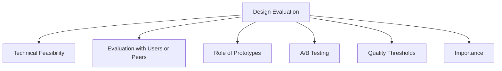

# Design Evaluation

Evaluation is used to determine whether a design successfully meets user needs and provides a good user experience. In interaction design, evaluation is important because it helps identify problems before a product is fully developed or released.

Interaction design focuses on externally visible and measurable behavior. Designers are interested in how users interact with a system and whether they can achieve their goals effectively.

## Technical Feasibility

A design must be technically feasible as well as usable. Evaluation helps determine whether proposed solutions can realistically be implemented.

## Evaluation with Users or Peers

Design alternatives can be evaluated by:

- Potential users
- Designers
- Peers
- Other stakeholders

Feedback from these groups helps identify strengths and weaknesses in a design.

## Role of Prototypes

Interaction design emphasizes prototypes rather than static documentation because behavior is a key part of user interaction.

Prototypes allow evaluators to:

- Observe user interactions
- Test design ideas
- Identify usability issues
- Compare alternative designs

## A/B Testing

A/B Testing is an online evaluation method used to compare two or more design alternatives.

Different versions are shown to different groups of users, and the results are measured to determine which design performs better.

A/B Testing requires:

- Appropriate evaluation metrics
- Carefully selected user groups

## Quality Thresholds

Different stakeholder groups may have different expectations of quality.

A design that is acceptable to one group may not satisfy another.

Usability goals and user experience goals provide criteria for deciding whether a design meets the required quality threshold.

## Importance

Evaluation helps designers make informed decisions when choosing between alternatives and supports the creation of designs that are useful, usable, and satisfying for users.
