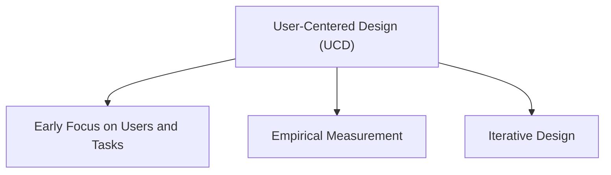

# User-Centered Design (UCD)

User-Centered Design (UCD) is an approach to interaction design that places users, their needs, and their tasks at the center of the design process. The goal is to ensure that products are designed based on a clear understanding of the people who will use them.

A user-centered approach is based on three main principles.

## Early Focus on Users and Tasks

Designers study users from the beginning of the project rather than making assumptions about them.

This includes examining:

- Cognitive characteristics
- Behavioral characteristics
- Anthropomorphic characteristics
- Attitudinal characteristics

The aim is to understand who the users are, what they do, how they work, and what they need from the system.

## Empirical Measurement

Design decisions are supported by observation and evidence rather than personal opinions.

Users interact with:

- Scenarios
- Manuals
- Simulations
- Prototypes

Their reactions and performance are then:

- Observed
- Recorded
- Measured
- Analyzed

The collected data helps determine whether the design successfully supports users and their tasks.

## Iterative Design

Design is treated as a continuous improvement process.

When user testing identifies problems:

1. The problems are analyzed.
2. The design is modified.
3. Additional testing is carried out.
4. The cycle repeats until the design improves.

This iterative process helps refine the product and ensures that usability and user experience issues are addressed before release.

User-Centered Design therefore relies on understanding users early, evaluating designs using measurable evidence, and repeatedly refining solutions based on user feedback.
