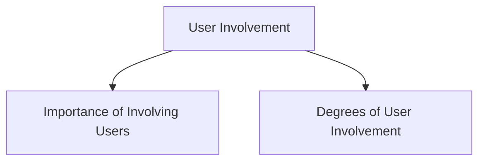

# User Involvement

User involvement is an important part of interaction design because users are the people who will ultimately use the product. Involving them throughout the design process helps ensure that the final system meets their needs and expectations.

## Importance of Involving Users

### Expectation Management

Involving users helps create realistic expectations about what the product can and cannot do.

Benefits include:

- Realistic expectations
- No surprises or disappointments
- Timely training opportunities
- Better communication throughout the project
- Avoiding unnecessary hype about the product

### Ownership

When users participate in the design process, they become active stakeholders rather than passive recipients of the final product.

Benefits include:

- Greater sense of ownership
- Increased acceptance of the product
- More willingness to forgive or tolerate minor problems
- Higher likelihood of project success

## Degrees of User Involvement

Users can participate in different ways and at different levels throughout a project.

### Member of the Design Team

Users may become part of the design team itself.

#### Full-Time

- Constant input from the user
- User may gradually lose touch with the wider user community

#### Part-Time

- Input can be inconsistent or patchy
- Can be stressful for the participating user

#### Short-Term

- User involvement occurs for limited periods
- Input may not remain consistent throughout the project

#### Long-Term

- Provides consistent involvement across the project lifecycle
- User may eventually become less representative of ordinary users

### Face-to-Face Activities

Users can participate individually or in groups through meetings, workshops, interviews, and discussions.

### Online Contributions

Large numbers of users can contribute remotely through online platforms.

Examples include:

- Online contributions from thousands of users
- Online Feedback Exchange (OFE) systems
- Crowdsourcing design ideas
- Citizen science projects

### User Involvement After Product Release

User participation does not end when the product is launched. Feedback collected after release can be used to improve future versions and updates.

User involvement can therefore occur before, during, and after the development process, providing valuable insights at every stage.
