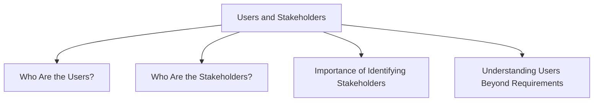

# Users and Stakeholders

Identifying users and stakeholders is an important part of the interaction design process. Designers need to understand who will use the product and who may be affected by it.

## Who Are the Users?

Identifying users is not always straightforward.

Research on smartphone applications identified **382 distinct types of users**, showing that products may serve a wide variety of people.

Some products are intended for large sections of the population, making the user group effectively "everybody."

Other products are designed for specific groups of people associated with particular roles, tasks, or responsibilities.

Because different users may have different goals and expectations, understanding the intended user population is essential for successful design.

## Who Are the Stakeholders?

Stakeholders are individuals or groups who have an interest in the product.

The stakeholder group is usually larger than the group of direct users.

Stakeholders may include:

- Direct users
- Indirect users
- Clients
- Managers
- Developers
- Organizations affected by the system

Identifying stakeholders helps designers understand different perspectives and requirements that may influence the design.

## Importance of Identifying Stakeholders

Identifying stakeholders helps interaction designers:

- Understand who is affected by the product
- Discover different needs and expectations
- Identify groups that should participate in design activities
- Gather a wider range of feedback
- Improve design decisions

Including relevant stakeholders in interaction design activities increases the likelihood that the final product will meet the needs of all important groups.

## Understanding Users Beyond Requirements

Users rarely know what is technically possible, so designers should not simply ask users to specify solutions.

Instead, designers should:

- Explore the problem space
- Investigate who the users are
- Investigate user activities
- Examine what aspects of current activities can be improved
- Try out ideas with potential users

The focus should remain on:

- People's goals
- Usability goals
- User experience goals

Rather than expecting stakeholders to fully articulate system requirements, designers should study users and their activities to discover what is actually needed.
