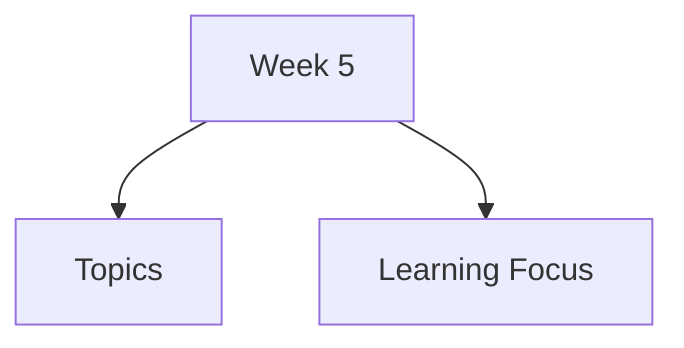

# Week 5

Week 5 covers discovering requirements for interactive systems. Focus is on understanding users, tasks, environments, data, usability goals, and methods for collecting design evidence.

## Topics

- [Discovering Requirements](discovering-requirements/)
- [Types of Requirements](types-of-requirements/)
  - [Functional & Data Requirements](types-of-requirements/functional-data-requirements/)
  - [User & Environment Requirements](types-of-requirements/user-environment-requirements/)
  - [Usability & UX Goals](types-of-requirements/usability-ux-goals/)
- [Data Gathering Techniques](data-gathering-techniques/)
  - [Interviews & Questionnaires](data-gathering-techniques/interviews-questionnaires/)
  - [Observation & Ethnography](data-gathering-techniques/observation-ethnography/)
  - [Contextual Inquiry](data-gathering-techniques/contextual-inquiry/)
  - [Brainstorming](data-gathering-techniques/brainstorming/)
- [Personas](personas/)
- [Scenarios](scenarios/)
- [Design Fiction](design-fiction/)
- [Use Cases](use-cases/)

## Learning Focus

By end of this week, you should be able to identify requirement types, choose suitable data gathering methods, and use personas, scenarios, design fiction, and use cases to communicate user needs.
