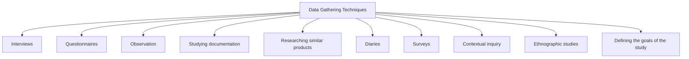

# Data Gathering Techniques

Data gathering is the process of collecting information from users, stakeholders, and existing systems to understand requirements and the context in which a product will be used.

The goal of data gathering is to obtain accurate and useful information that supports the discovery of requirements and helps designers make informed decisions.

Requirements data can be gathered from multiple sources, including users, documentation, existing products, and real-world work environments.

Common data gathering techniques include:

- Interviews
- Questionnaires
- Observation
- Studying documentation
- Researching similar products
- Diaries
- Surveys
- Contextual inquiry
- Ethnographic studies

Data gathering should be carefully planned and guided by clear goals.

Important issues to consider include:

- Defining the goals of the study
- Identifying appropriate participants
- Maintaining a professional relationship with participants
- Using multiple sources of data (triangulation)
- Conducting pilot studies before the main study

Information can be recorded using:

- Written notes
- Audio recordings
- Video recordings
- Photographs
- Combinations of these methods

Different techniques provide different types of information, and multiple techniques are often combined to obtain a more complete understanding of users, tasks, and environments.

The choice of technique depends on:

- The focus of the study
- The participants involved
- Available resources
- Available time
- The type of information required
