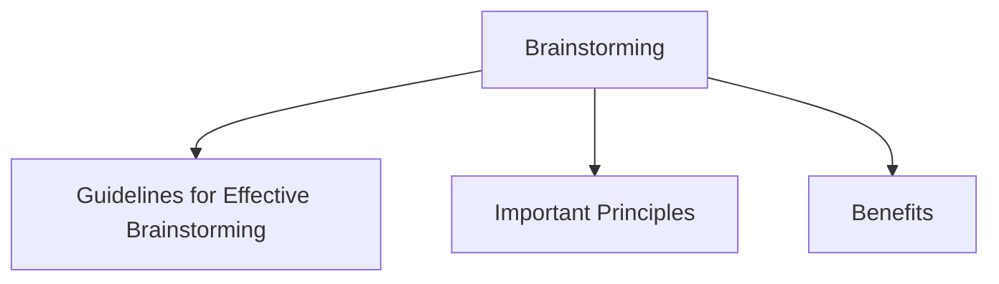

# Brainstorming

Brainstorming is a technique used to generate new ideas, explore possibilities, and encourage innovation during the requirements and design process.

The goal is to produce a large number of ideas without immediately judging or evaluating them.

Brainstorming helps teams think creatively about user needs, problems, and potential solutions.

## Guidelines for Effective Brainstorming

| Guideline | Description |
|------------|-------------|
| Include Diverse Participants | Involve people from different disciplines and with different levels of experience. |
| Don't Ban Silly Ideas | Unusual ideas can inspire valuable solutions. |
| Use Catalysts | Use ideas, examples, or materials that stimulate further thinking. |
| Keep Records | Capture every idea without censoring or filtering. |
| Sharpen the Focus | Keep the discussion related to the problem being addressed. |
| Make it Fun | Use warm-up activities and maintain an engaging atmosphere. |

## Important Principles

- Generate as many ideas as possible.
- Encourage creativity and free thinking.
- Avoid criticizing ideas during the session.
- Build upon the ideas of others.
- Record all suggestions for later evaluation.

## Benefits

- Encourages innovation.
- Generates a wide range of ideas.
- Promotes collaboration among team members.
- Helps identify new requirements and opportunities.
- Supports creative problem solving during design.
