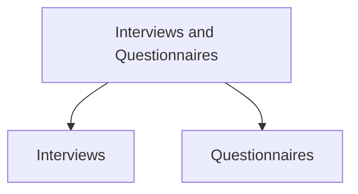

# Interviews & Questionnaires

Interviews and questionnaires are commonly used data gathering techniques for understanding users, their needs, opinions, experiences, and requirements.

## Interviews

An interview is a direct conversation between a researcher and participant used to gather detailed information.

### Types of Interviews

| Type | Description |
|--------|-------------|
| Unstructured | No fixed script. Rich information but difficult to replicate. |
| Structured | Follows a fixed script. Easier to replicate but less detailed. |
| Semi-Structured | Guided by a script while allowing deeper exploration of interesting topics. Provides a balance between richness and consistency. |
| Focus Group | A group interview involving multiple participants. |

### Types of Questions

| Type | Description |
|--------|-------------|
| Closed Questions | Have predefined answers such as Yes/No. Easier to analyze. |
| Open Questions | Allow participants to answer freely and provide more detail. |

### Avoid During Interviews

- Long questions
- Compound questions
- Technical jargon participants may not understand
- Leading questions
- Unconscious biases and stereotypes

### Running an Interview

| Stage | Purpose |
|---------|---------|
| Introduction | Explain goals, ethics, recording, and consent. |
| Warm-up | Begin with easy questions. |
| Main Body | Ask questions in a logical order. |
| Cool-off | End with simple questions to reduce tension. |
| Closure | Thank the participant and formally end the interview. |

### Digital Interviews

Interviews can also be conducted using:

- Zoom
- Skype
- Email
- Smartphones

Advantages:

- Participants remain in their own environment.
- No travel is required.
- Greater comfort and convenience.
- Easier anonymity for sensitive topics.

### Interview Props

Props can be used to encourage discussion, such as:

- Prototypes
- Scenarios
- Mockups

## Questionnaires

A questionnaire is a set of written questions used to gather information from many participants.

### Characteristics

- Can contain open or closed questions.
- Can be distributed to large populations.
- Easier to distribute and analyze using computers.
- Available in paper, email, and web formats.

### Questionnaire Design Guidelines

- Provide clear instructions.
- Keep questions concise.
- Avoid very long questionnaires.
- Consider question order carefully.
- Balance white space and compactness.
- Use appropriate wording throughout.

### Response Formats

- Yes/No checkboxes
- Multiple-option checkboxes
- Rating scales
- Likert scales
- Semantic scales
- Open-ended responses

### Encouraging Responses

- Clearly explain the purpose.
- Promise anonymity when appropriate.
- Design the questionnaire well.
- Offer shorter versions if needed.
- Follow up with reminders.
- Provide incentives.

A response rate of:

- 40% is considered good.
- 20% is often acceptable.

### Online Questionnaires

#### Advantages

- Quick distribution
- Fast responses
- No printing or postage costs
- Automatic data collection
- Easier analysis
- Easy error correction

#### Problems

- Sampling difficulties when population size is unknown.
- Multiple submissions by the same individual.
- Questions may be modified in email questionnaires.

### Deploying Online Questionnaires

1. Plan the timeline.
2. Design the questionnaire offline.
3. Create the online version.
4. Test functionality.
5. Test question clarity.
6. Recruit participants.
