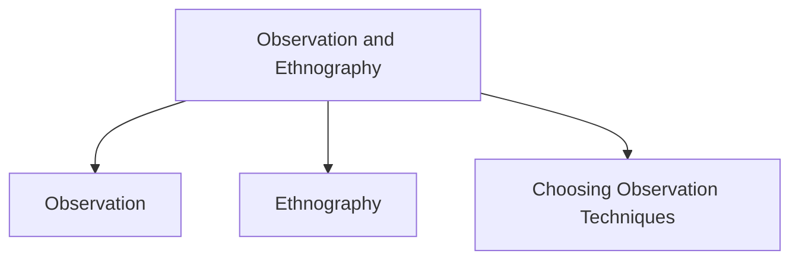

# Observation & Ethnography

Observation and ethnography are data gathering techniques used to understand what people actually do in real-world settings rather than what they say they do.

They help researchers understand users, tasks, environments, interactions, and work practices.

## Observation

Observation involves watching users, their activities, and their environment.

### Types of Observation

| Type | Description |
|--------|-------------|
| Direct Observation | Researcher observes users directly. |
| Indirect Observation | User activities are tracked through other means. |

### Observation Settings

| Setting | Description |
|----------|-------------|
| Field Observation | Conducted in the user's natural environment. |
| Controlled Observation | Conducted in a controlled setting such as a laboratory. |

### Indirect Observation Methods

- Diaries
- Interaction logs
- Web analytics
- Remote video recordings
- Remote photographs
- Activity tracking

### Structuring Observation

A simple framework focuses on:

| Element | Question |
|----------|----------|
| Person | Who? |
| Place | Where? |
| Thing | What? |

A more detailed framework includes:

- Space
- Actors
- Activities
- Objects
- Acts
- Events
- Time
- Goals
- Feelings

### Planning Field Observation

Researchers must decide:

- Their level of involvement
- How to gain acceptance
- How to handle sensitive topics
- What data to collect
- What equipment to use
- When to stop observing

### Recording Observation Data

Data may be collected through:

- Notes
- Audio recordings
- Video recordings
- Photographs

## Ethnography

Ethnography is a research philosophy and set of techniques that aims to understand people within their natural culture and environment.

It often combines:

- Observation
- Participant observation
- Interviews

### Characteristics of Ethnography

- Researchers immerse themselves in the culture being studied.
- The degree of participation may vary.
- Understanding develops over time.
- Data analysis is continuous.
- Questions are refined as knowledge grows.
- Reports often contain real examples and observations.

### Requirements for Ethnography

- Cooperation from participants
- Access to the environment being studied
- Informants who help explain activities and culture

### Materials Collected During Ethnography

- Activity descriptions
- Job descriptions
- Rules and procedures
- Observed activities
- Conversations and discussions
- Informal interviews
- Physical layout diagrams
- Photographs of artifacts
- Videos of artifacts
- Workflow diagrams
- Process maps

### Online Ethnography

Also known as:

- Virtual Ethnography
- Online Ethnography
- Netnography

Characteristics:

- Studies online communities and activities.
- Considers both online and offline behavior.
- Recognizes that online interaction differs from face-to-face interaction.
- Requires special ethical considerations.
- Uses different approaches for presenting findings.

## Choosing Observation Techniques

The choice of observation method depends on:

- Study goals
- Participants
- Available resources
- Available time
- Nature of the data required

Observation and ethnography are often combined with interviews, questionnaires, and other techniques to gain a more complete understanding of users and their environment.
