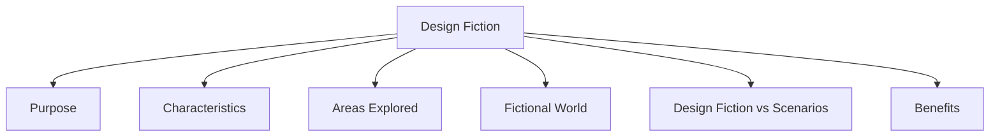

# Design Fiction

Design Fiction is a technique used to communicate visions of future technologies through fictional stories, situations, and worlds.

It allows designers to explore possibilities, challenges, and implications of technologies that may not yet exist.

Rather than focusing on current technical limitations, design fiction encourages thinking about how future technologies might affect people and society.

## Purpose

Design fiction is used to:

- Explore future technologies.
- Communicate design visions.
- Examine social and ethical issues.
- Encourage discussion about possible futures.
- Investigate the impact of technology on everyday life.

## Characteristics

| Characteristic | Description |
|----------------|-------------|
| Future-Oriented | Focuses on possible future technologies and situations. |
| Fictional | Uses imagined worlds, products, and scenarios. |
| Exploratory | Investigates possibilities rather than building actual systems. |
| Reflective | Encourages thinking about consequences and implications. |

## Areas Explored

Design fiction can be used to explore topics such as:

- Privacy
- Surveillance
- Ethics
- Human behavior
- Social impact of technology
- Future lifestyles

## Fictional World

A design fiction creates a fictional world in which:

- Technologies may be more advanced than today.
- Ethical issues can be examined.
- Emotional responses can be explored.
- Social and cultural contexts can be considered.

This allows designers to investigate ideas without being constrained by current technical limitations.

## Design Fiction vs Scenarios

| Scenarios | Design Fiction |
|------------|---------------|
| Focus on realistic use situations. | Focus on imagined future worlds. |
| Explore how users interact with a system. | Explore the broader implications of technology. |
| Usually based on existing or proposed products. | Often involves speculative technologies. |
| Concerned with solving user problems. | Concerned with questioning and exploring future possibilities. |

According to the notes:

- Scenarios are often about **"overcoming the monster"** (solving a problem).
- Design fiction is often about a **"quest"** (exploring possibilities and futures).

## Benefits

- Stimulates creativity and innovation.
- Encourages discussion about future technologies.
- Helps identify ethical and social concerns.
- Supports strategic thinking about design directions.
- Makes abstract future concepts easier to understand and communicate.
