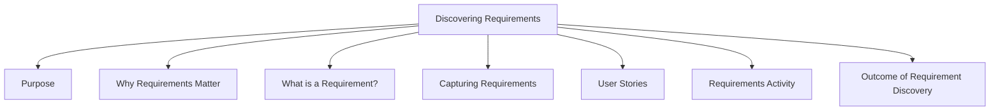

# Discovering Requirements



## Purpose

Discovering requirements is the process of understanding the problem space and determining what a product should do, how it should behave, and how it should support its users.

The main goals are to:

- Explore the problem space.
- Understand user needs and expectations.
- Establish a clear description of the product to be developed.
- Create a foundation for design and development activities.

## Why Requirements Matter

Requirements activities are one of the stages where miscommunication most commonly occurs.

Well-defined requirements help to:

- Reduce misunderstandings between stakeholders.
- Ensure that users and developers share the same expectations.
- Support communication among designers, developers, and clients.
- Guide future design and implementation decisions.

## What is a Requirement?

A requirement is a statement about an intended product that specifies:

- What it is expected to do.
- How it is expected to perform.

Requirements can be written at different levels of detail and abstraction depending on the project needs.

## Capturing Requirements

Once requirements are discovered, they can be captured in different ways, including:

- Prototypes
- Operational products
- Structured notations
- Formal documentation
- User stories
- Use cases

Different methods highlight different aspects of a system and may emphasize certain requirements while de-emphasizing others.

## User Stories

User stories are a common way of expressing requirements, especially in agile development.

General format:

```text
As a <role>,
I want <behavior>,
so that <benefit>
```

Example:

```text
As a traveler,
I want to save my favorite airline for all my flights,
so that I can collect air miles.
```

Example:

```text
As a travel agent,
I want my special discount rates to be displayed,
so that I can offer my clients competitive rates.
```

## Requirements Activity

The requirements activity focuses on answering three important questions:

### What?

What should the product do?

### How?

How should requirements be represented and captured?

Examples:

- User stories
- Prototypes
- Documentation
- Use cases

### Why?

Why is the product needed?

Understanding the reason behind a requirement helps ensure that development focuses on solving real user problems.

## Outcome of Requirement Discovery

By the end of requirement discovery, the development team should have:

- A clear understanding of the problem space.
- Knowledge of user needs and expectations.
- A description of the intended product.
- A basis for design and development decisions.
- Reduced risk of miscommunication among stakeholders.
