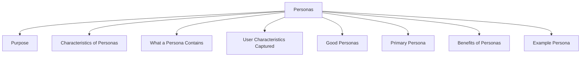

# Personas

Personas are rich descriptions of typical users that help designers understand who will use a product and what their needs are.

They are not descriptions of specific individuals but are created from information gathered through user research.

Personas bring requirements to life by making users more concrete and relatable.

## Purpose

Personas help teams:

- Understand users better.
- Focus on real user needs.
- Support design decisions.
- Keep users central throughout development.

## Characteristics of Personas

| Characteristic | Description |
|----------------|-------------|
| Based on Research | Created from information gathered from real users. |
| Typical, Not Idealized | Represent common user types rather than perfect users. |
| User-Focused | Reflect characteristics relevant to the product being designed. |
| Realistic | Include details that make them feel like real people. |

## What a Persona Contains

A persona typically includes:

- Name
- Personal background
- Characteristics
- Goals
- Behaviors
- Experience level
- Relevant user needs

## User Characteristics Captured

Personas may include information such as:

- Nationality
- Educational background
- Attitude toward technology
- Level of expertise
- Frequency of system use
- Personal goals and motivations

## Good Personas

A good persona:

- Represents a realistic user type.
- Helps designers make design decisions.
- Reminds the team who the product is being designed for.
- Focuses on information relevant to the project.

## Primary Persona

Projects should usually develop a small set of personas.

Among them, one should be identified as the **primary persona**.

The primary persona represents the main target user whose needs receive the highest priority during design.

## Benefits of Personas

- Make users easier to understand.
- Humanize requirements.
- Improve communication within the team.
- Support user-centered design.
- Help evaluate design choices from a user perspective.

Personas are often used together with scenarios to create a richer understanding of how users may interact with a product.

## Example Persona

| Attribute | Details |
|------------|---------|
| Name | Sarah Ahmed |
| Age | 21 |
| Occupation | University Student |
| Background | Studies Computer Science and frequently uses online learning platforms. |
| Technology Experience | Experienced computer and smartphone user. |
| Goals | Quickly access course materials, submit assignments, and track academic progress. |
| Frustrations | Complex navigation, slow-loading pages, and difficult-to-find resources. |
| System Usage | Frequent user who accesses the platform daily. |
| Needs | Fast access to important features, clear navigation, and reliable notifications. |

