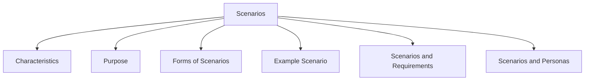

# Scenarios

Scenarios are informal narrative stories that describe how people might use a product in a particular situation.

They help designers understand user activities, goals, and interactions within a realistic context.

Scenarios bring requirements to life by showing how a product may be used in practice.

## Characteristics

| Characteristic | Description |
|----------------|-------------|
| Informal | Written in everyday language rather than technical notation. |
| Story-Based | Presented as a narrative describing a situation. |
| Personal | Focuses on specific users and their goals. |
| Contextual | Describes the environment and circumstances of use. |
| Concrete | Uses realistic situations and activities. |

## Purpose

Scenarios are used to:

- Explore current user behavior.
- Understand how a proposed system may be used.
- Identify user needs and requirements.
- Support design discussions.
- Communicate ideas among stakeholders.

## Forms of Scenarios

Scenarios can be presented in different forms:

- Textual descriptions
- Animations
- Audio recordings
- Videos

## Example Scenario

The Thomson family enjoys outdoor activities and wants to try sailing for the first time.

The family consists of Sky (8 years old), Eamonn (12 years old), Claire (32), and Will (35). One evening they begin discussing possible vacation ideas. Claire needs to visit her elderly mother, so she joins the discussion remotely from another location.

Will enters the idea of a sailing trip for four beginners in the Mediterranean into the travel organizer system.

The system supports multiple users connecting from different locations and devices, allowing the entire family to participate in planning.

The system recommends a flotilla vacation, where several boats travel together. Initially, the children dislike the idea of vacationing alongside other groups.

To help them decide, the system provides reviews and experiences from other children of similar ages who participated in flotilla trips.

After reading the positive experiences, the family agrees to explore the recommendation further.

Will requests more detailed options and asks the system to save the information for later review.

The travel organizer then emails a summary of the available options to all family members.

## Scenarios and Requirements

Scenarios help reveal:

- User goals
- User tasks
- User interactions
- Context of use
- System requirements

They provide a realistic picture of how a product may support users in achieving their objectives.

## Scenarios and Personas

Scenarios are often used together with personas.

- Personas describe **who** the users are.
- Scenarios describe **how** those users interact with a product in a particular situation.

Together they help designers better understand users and their needs.
