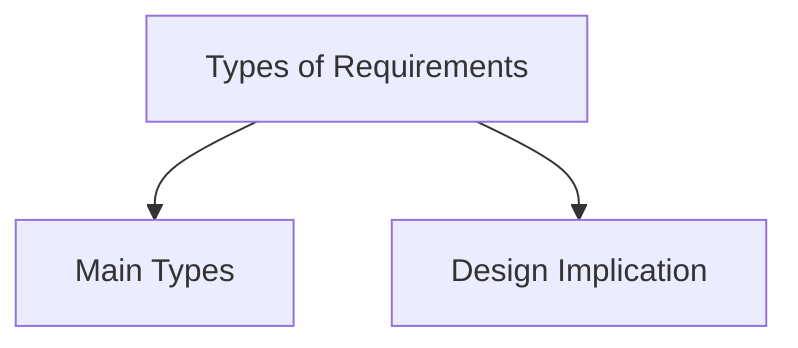

# Types of Requirements

Requirements describe what system must do, what data it must handle, who will use it, where it will be used, and what quality of experience it must provide.

## Main Types

- Functional requirements.
- Data requirements.
- User requirements.
- Environment requirements.
- Usability and UX goals.

## Design Implication

Different requirement types answer different questions. Missing one type can produce system that works technically but fails in real use.
