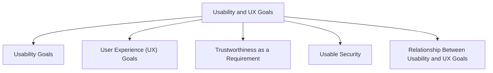

# Usability & UX Goals

Usability goals and user experience (UX) goals are requirements that help ensure a product is not only functional but also satisfying and appropriate for its users.

Different products may have different usability and UX requirements and may achieve them in different ways.

## Usability Goals

Usability goals focus on how effectively and efficiently users can interact with a system.

| Goal | Description |
|--------|-------------|
| Effectiveness | Users can successfully complete their intended tasks. |
| Efficiency | Tasks can be completed with minimal effort and time. |
| Safety | Users are protected from making serious errors and can recover from mistakes. |
| Utility | The system provides the functions users need. |
| Learnability | New users can learn to use the system easily. |
| Memorability | Users can remember how to use the system after a period of not using it. |

Usability goals are concerned with task performance and ease of use.

## User Experience (UX) Goals

UX goals focus on how users feel when interacting with a product.

They address the emotional, experiential, and subjective aspects of interaction.

| UX Goal | Description |
|----------|-------------|
| Satisfying | Provides a pleasant and rewarding experience. |
| Enjoyable | Makes interaction enjoyable and engaging. |
| Fun | Creates a sense of entertainment or amusement. |
| Entertaining | Keeps users interested and engaged. |
| Helpful | Assists users in achieving their goals. |
| Motivating | Encourages users to continue using the product. |
| Aesthetically Pleasing | Creates a visually attractive experience. |
| Supportive of Creativity | Helps users express ideas and create content. |
| Rewarding | Gives users a sense of achievement. |
| Emotionally Fulfilling | Produces positive emotional responses. |

## Trustworthiness as a Requirement

Different products may have different UX requirements.

For some systems, trustworthiness is especially important.

Examples include:

- Banking systems
- Healthcare systems
- Government services
- Security applications

The way trustworthiness is achieved may differ from one product to another.

## Usable Security

Security should be strong without reducing usability or damaging the user experience.

The goal is to make security mechanisms robust while allowing users to complete tasks comfortably.

### Why It Matters

If the usability of security is ignored:

- Users may become frustrated.
- Security features may be bypassed.
- Security mechanisms may be circumvented.

### Passwords as an Example

Passwords illustrate the balance between security and usability.

Problems include:

- Excessive advice about password creation.
- Complex password requirements.
- Difficulty remembering passwords.

As a result, users may adopt coping strategies that weaken security, such as:

- Reusing passwords.
- Writing passwords down.
- Choosing predictable passwords.

## Relationship Between Usability and UX Goals

| Usability Goals | UX Goals |
|----------------|-----------|
| Focus on task performance | Focus on user feelings and experiences |
| Objective and measurable | More subjective and emotional |
| Concerned with effectiveness and efficiency | Concerned with satisfaction, enjoyment, and engagement |
| Evaluate how well users complete tasks | Evaluate how users experience the interaction |

Both usability goals and UX goals are important because a successful product must not only work well but also provide a positive experience for its users.
