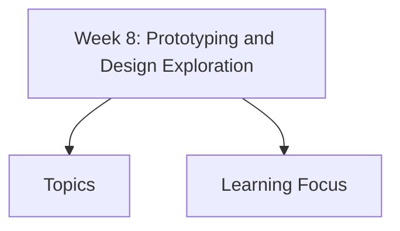

# Week 8: Prototyping and Design Exploration

Week 8 covers designing with people, participatory methods, prototyping, conceptual design, wireframes, and design exploration. Focus is moving from user understanding to visible, testable design ideas.

## Topics

- [Designing with or for People](designing-with-or-for-people/)
- [Prototyping Overview](prototyping-overview/)
- [Types of Prototypes](types-of-prototypes/)
  - [Low-Fidelity Prototyping](types-of-prototypes/low-fidelity-prototyping/)
    - [Storyboards](types-of-prototypes/low-fidelity-prototyping/storyboards/)
    - [Sketching Techniques](types-of-prototypes/low-fidelity-prototyping/sketching-techniques/)
    - [Index Card Prototyping](types-of-prototypes/low-fidelity-prototyping/index-card-prototyping/)
    - [Wizard-of-Oz Prototyping](types-of-prototypes/low-fidelity-prototyping/wizard-of-oz-prototyping/)
  - [High-Fidelity Prototyping](types-of-prototypes/high-fidelity-prototyping/)
- [Prototyping Compromises](horizontal-vs-vertical-prototypes/)
- [Conceptual Design](conceptual-design/)
- [Interface Metaphors](interface-metaphors/)
- [Wireframes](wireframes/)
  - [Wireframe Design Rules](wireframes/wireframe-design-rules/)
- [Lo-fi vs Hi-fi Design](lo-fi-vs-hi-fi-design/)
- [Concrete Design and Construction](concrete-design-construction/)
- [Scenarios and Design Exploration](scenarios-design-exploration/)

## Learning Focus

By end of this week, you should be able to choose appropriate prototyping methods, involve users and communities in design, compare prototype types, and use wireframes, metaphors, and scenarios to explore design ideas.
