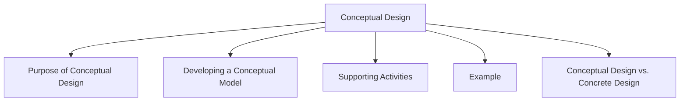

# Conceptual Design

Conceptual design focuses on developing a conceptual model of a product before detailed interface design begins.

A conceptual model is an outline of what users can do with a product and the concepts they need to understand in order to interact with it successfully.

At this stage, designers concentrate on the overall idea of how the system will work rather than specific details such as colors, layouts, or visual appearance.

## Purpose of Conceptual Design

Conceptual design helps designers:

- Define the main functionality of a product
- Understand how users will interact with the system
- Explore different design alternatives
- Establish the core concepts users must learn
- Create a foundation for detailed design

## Developing a Conceptual Model

When creating a conceptual model, designers consider:

- What users want to accomplish
- What actions users can perform
- What information the system should provide
- How users will understand and control the system
- How tasks and functions relate to each other

## Supporting Activities

### Creativity and Brainstorming

Creative thinking and brainstorming are used to generate multiple design ideas before selecting a solution.

This encourages exploration of different approaches and prevents designers from focusing too early on a single idea.

### Considering Alternatives

Different solutions should be explored and compared before making design decisions.

Designers use techniques such as:

- Scenarios
- Storyboards
- Prototypes

to evaluate and refine alternative concepts.

## Example

For a food delivery application, a conceptual model may define that users can:

- Browse restaurants
- Search for meals
- Add items to a cart
- Place orders
- Track deliveries

The conceptual design focuses on these activities and how users understand them, rather than on the exact appearance of buttons, menus, or screens.

## Conceptual Design vs. Concrete Design

| Conceptual Design | Concrete Design |
|------------------|-----------------|
| Focuses on what users can do | Focuses on how the interface looks and behaves |
| Defines concepts and functionality | Defines layout, navigation, and interface details |
| Explores alternative ideas | Refines a chosen design |
| Occurs early in the design process | Occurs after the conceptual model is established |

Conceptual design provides the foundation upon which detailed interface design and implementation are built.
