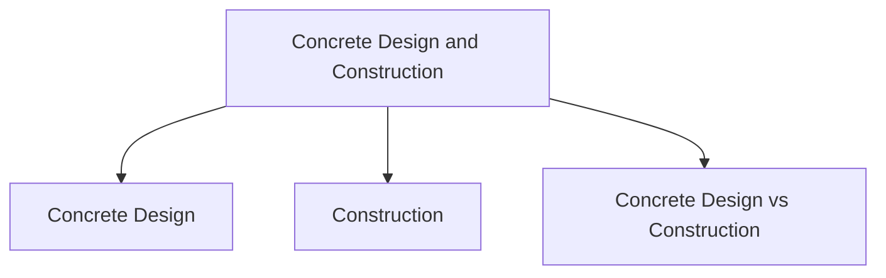

# Concrete Design and Construction

While conceptual design focuses on what users can do with a product, concrete design focuses on the specific details of how the product will look and behave.

Concrete design transforms abstract ideas and conceptual models into detailed interface designs that can be implemented and tested. It specifies the elements users will interact with and how those elements are organized.

## Concrete Design

Concrete design defines details such as:

- Screen layouts
- Navigation structures
- Interface components
- Information organization
- User interactions
- Visual arrangement of content

Design artifacts commonly used during concrete design include:

- Wireframes
- Mockups
- Storyboards
- Prototypes

The goal is to refine and communicate the design before development begins.

## Construction

Construction is the stage where designs are implemented and transformed into a working product.

During construction:

- Software is developed
- Hardware components are integrated (if required)
- Interface designs are implemented
- Features and functionality are built
- The system moves from prototype to a functional product

Modern development is supported by:

- Software Development Kits (SDKs)
- Existing software frameworks
- Physical computing kits
- Development tools and libraries

These tools help bridge the gap between design and implementation.

## Concrete Design vs Construction

| Concrete Design | Construction |
|-----------------|-------------|
| Defines interface details | Builds the actual system |
| Focuses on layout and interaction | Focuses on implementation |
| Uses wireframes and prototypes | Uses code, hardware, and development tools |
| Answers "How should it look and behave?" | Answers "How do we build it?" |
| Produces design specifications | Produces a working product |

Concrete design refines the user experience, while construction turns those design decisions into a functioning system.
