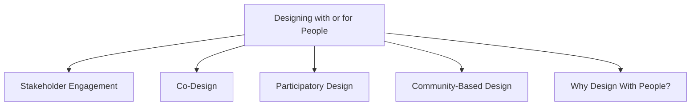

# Designing with or for People

Interaction design is increasingly moving from designing *for* people to designing *with* people. Instead of treating users only as sources of requirements, modern design approaches involve stakeholders directly in the design process.

## Stakeholder Engagement

Traditional design often views stakeholder involvement as a one-way process where designers gather information and make decisions.

Modern approaches encourage active participation, where stakeholders contribute ideas, feedback, and design decisions throughout development.

## Co-Design

Co-design is a collaborative approach where designers and stakeholders work together to create solutions.

Characteristics:

- Emphasizes creativity
- Encourages mutual learning
- Involves collaboration between different disciplines
- Treats stakeholder knowledge as valuable input

## Participatory Design

Participatory Design originated in Scandinavia and focuses on direct stakeholder involvement.

Characteristics:

- Stakeholders act as design partners
- Users participate in decision-making
- Cooperative prototyping is an important activity
- Design solutions are developed collaboratively

## Community-Based Design

Community-Based Design extends participation to larger groups of people.

Characteristics:

- Involves communities rather than individual users
- Supports diverse participants and perspectives
- Considers differences in needs and experiences
- Scales participation across larger populations

## Why Design With People?

Designing with people helps:

- Improve understanding of user needs
- Generate better design ideas
- Encourage collaboration between stakeholders
- Support shared learning throughout the design process
- Create solutions that better fit real-world contexts
