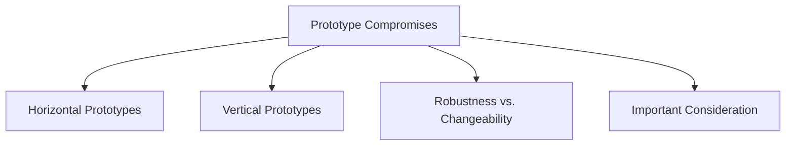

# Prototype Compromises

Prototypes are created to explore, test, and evaluate design ideas rather than serve as complete products. As a result, they often involve compromises that balance development effort, realism, functionality, and flexibility.

When interpreting prototype results, it is important to understand what aspects of the design are fully represented and what aspects have been simplified.

## Horizontal Prototypes

A horizontal prototype provides a broad view of the system by covering many features and interface areas, but with limited detail or functionality.

### Characteristics

- Large feature coverage
- Limited implementation depth
- Focus on overall structure and navigation
- Useful for evaluating workflows and interface organization

### Example

A food delivery app prototype may include:

- Home page
- Search page
- Restaurant listings
- Cart page
- Profile page

All screens can be accessed, but buttons and features may not fully work.

### Advantages

- Demonstrates the overall system
- Tests navigation and screen layout
- Covers many user tasks

### Limitation

- Individual features are not implemented in detail

## Vertical Prototypes

A vertical prototype focuses on a small number of features but implements them in significant detail.

### Characteristics

- Narrow feature coverage
- High level of functionality
- Focus on specific interactions
- Useful for testing critical tasks

### Example

A banking app prototype may only implement:

- User login
- Account balance viewing
- Money transfer

These features work realistically, while the rest of the system is absent.

### Advantages

- Provides realistic interaction
- Supports detailed usability testing
- Evaluates specific functions thoroughly

### Limitation

- Does not represent the complete system

## Robustness vs. Changeability

Another common compromise is between robustness and changeability.

| Robustness | Changeability |
|------------|---------------|
| Stable and reliable | Easy to modify and update |
| Closer to a final product | Better for experimentation |
| More difficult to change | Supports rapid iteration |
| Requires more development effort | Requires less development effort |

A highly robust prototype may be difficult to modify, while a highly changeable prototype may not be stable enough for extensive testing.

## Important Consideration

Because prototypes contain compromises, they should not be mistaken for fully engineered products. A final system must still be properly developed, tested, optimized, and engineered before deployment.
