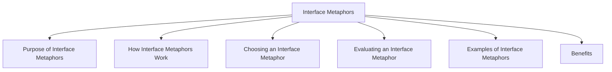

# Interface Metaphors

An interface metaphor is a design concept that uses familiar real-world objects, environments, or experiences to help users understand how a system works.

By connecting new technology with concepts users already know, interface metaphors make interfaces easier to learn and use. They rely on existing knowledge to create more intuitive interactions.

## Purpose of Interface Metaphors

Interface metaphors help users:

- Understand system functionality more quickly
- Predict how interface elements behave
- Learn new systems with less effort
- Transfer knowledge from the real world to the digital environment

## How Interface Metaphors Work

An interface metaphor combines:

- Familiar knowledge from the real world
- New knowledge about the system

The goal is to help users form a mental model of how the product operates.

## Choosing an Interface Metaphor

Designers typically follow three steps:

1. Understand the system's functionality.
2. Identify potential problem areas for users.
3. Generate suitable metaphors that can explain the interaction.

## Evaluating an Interface Metaphor

A good interface metaphor should answer the following questions:

| Question | Purpose |
|-----------|---------|
| How much structure does it provide? | Determines how well it organizes interaction |
| How much is relevant to the problem? | Ensures the metaphor matches the task |
| Is it easy to represent? | Checks whether it can be implemented clearly |
| Will the audience understand it? | Ensures users recognize the metaphor |
| How extensible is it? | Determines whether it can support future features |

## Examples of Interface Metaphors

| Interface Feature | Real-World Metaphor |
|------------------|---------------------|
| Desktop Interface | Office desk |
| Folder Icons | Physical folders |
| Trash / Recycle Bin | Waste basket |
| Shopping Cart | Real shopping cart |
| Calendar Application | Paper calendar |

### Example 1: Desktop Interface

Users organize files on a virtual desktop just as they would place documents on a physical desk.

### Example 2: Recycle Bin

Deleting a file moves it to a recycle bin, similar to throwing paper into a waste basket.

### Example 3: Shopping Cart

Items selected while shopping online are placed into a virtual cart before checkout, similar to shopping in a physical store.

## Benefits

- Improves learnability
- Reduces training requirements
- Makes interfaces more intuitive
- Helps users build mental models
- Supports easier navigation and interaction

Interface metaphors are most effective when they use concepts that are already familiar to the target users and closely match the functionality of the system.
